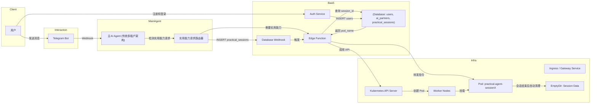

# 大同世界（WeAreAll.World） 实用能力子AI Agent（基于OpenClaw）技术规格说明书

> 项目名称：大同世界（WeAreAll.World） Practical Sub-Agent (MVP)
> 版本：v2.0
> 日期：2026-02-23
> 目标受众：外包开发团队
> 基础设施：云服务 CCE (Kubernetes)
> 后端服务：Supabase (BaaS)
> 试点平台：Telegram
> 架构模式：按需启动、会话隔离、自动清理

---

## 1. 项目概述

### 1.1 核心目标

构建一个 C 端友好的 OpenClaw 托管服务，作为 **大同世界（WeAreAll.World）** 游戏的 **实用能力子AI Agent**，用户在需要实用能力时可以按需启动独立的 OpenClaw 实例，提供个性化的实用能力服务。

### 1.2 核心原则（必须遵守）

1) **按需启动**
- 实用能力子AI Agent 仅在用户明确请求实用能力时启动，避免长期运行成本。
- 会话结束后自动销毁容器，释放资源。

2) **强隔离**
- 每个实用能力会话必须拥有独立的容器/虚拟机。
- 严禁多用户共享同一个 OpenClaw 进程或存储卷。
- 每个会话的数据完全隔离，确保用户隐私和安全。

3) **自动化**
- 用户请求实用能力后，后端需自动创建对应的 K8s 资源并完成配置映射。
- 会话超时或结束后自动清理资源。

4) **安全性**
- OpenClaw 拥有较高的系统权限，必须通过网络策略、RBAC 和资源配额限制其爆炸半径。
- 所有与实用能力子AI Agent的通信必须通过 Gateway Service 进行认证。

### 1.3 MVP 范围

- 平台：仅支持 Telegram（作为消息交互入口）。
- 用户体系：基于手机号注册（Supabase Auth）。
- 部署模式：云服务 CCE Kubernetes 集群托管 OpenClaw 容器。
- 功能：
  - **实用能力请求检测** → 自动创建专属 OpenClaw 容器（按需启动）。
  - **Telegram 消息路由** → 识别实用能力请求并路由至专属容器。
  - **会话管理** → 5分钟无活动自动关闭，1小时最大会话时长。
  - **资源自动清理** → 会话结束后自动销毁容器和存储资源。

---

## 2. 总体架构

系统采用混合架构，**主AI Agent** 采用传统的多用户服务架构处理基础对话和情感养成，**实用能力子AI Agent** 基于 OpenClaw 按需启动提供个性化实用能力服务。



### 2.1 组件说明

- **Telegram Bot**
  - 负责接收主AI Agent发来的请求，并满足需求。

- **主AI Agent**
  - 传统多用户服务架构，处理用户会话管理、记忆系统、剧情系统、新手引导、基础对话。
  - 检测实用能力请求，触发实用能力子AI Agent启动。

- **实用能力请求路由器**
  - 识别实用能力请求类型（文档处理、代码辅助、学习辅导等）。
  - 管理实用能力会话生命周期（启动、路由、结束、清理）。

- **Supabase Auth**
  - 处理用户注册、登录及 JWT 签发。

- **Supabase Database**
  - 存储用户档案（`users`）、AI伙伴信息（`ai_partners`）、实用能力会话状态（`practical_sessions`）。

- **Supabase Edge Function**
  - 接收 Database Webhook 事件（如创建实用能力会话）。
  - 充当 Kubernetes Controller，调用 K8s API 创建/销毁资源。
  - 定期清理过期会话（5分钟无活动自动关闭）。

- **Kubernetes Cluster（云服务 CCE）**
  - 运行按需启动的实用能力子AI Agent Pod。
  - 使用 EmptyDir 存储会话数据（会话结束后自动清理）。

---

## 3. 技术选型与环境准备

### 3.1 基础设施：云服务 CCE

- 服务：云容器引擎（CCE）。  
- 要求：  
  - 准备一个 CCE 集群（建议版本 v1.23+）。  
  - 配置一个 LoadBalancer 类型的 Service，用于接收 Telegram Webhook（公网可达）。  
  - （可选）配置 VPC Endpoint，以便 Supabase Edge Function 安全访问 K8s API Server。

### 3.2 后端即服务：Supabase

- Auth：启用 Email/Phone 登录。  
- Database：PostgreSQL（托管版）。  
- Edge Functions：Deno 运行时，用于编写业务逻辑。

### 3.3 核心应用：OpenClaw（实用能力子AI Agent）

- 镜像：`ghcr.io/openclaw/openclaw:latest`（或固定版本号）。
- 工作目录：
  - 配置：`/home/node/.openclaw`
  - 工作空间：`/home/node/.openclaw/workspace`（会话数据存储在 EmptyDir 中，会话结束后自动清理）
- 端口：
  - `18789`：Gateway（仅集群内访问，严禁暴露公网）。
- 生命周期：
  - 启动：用户请求实用能力时自动创建
  - 超时：5分钟无活动自动关闭
  - 最大时长：1小时后强制关闭
  - 清理：会话结束后自动销毁容器和存储资源

### 3.4 消息平台：Telegram

- 使用 Bot API 接收 Webhook 和发送消息。
- **注意**：Telegram Bot 直接与主AI Agent通信，实用能力子AI Agent通过主AI Agent间接与Telegram交互。

---

## 4. 数据库设计

在 Supabase 中创建以下表结构，用于管理实用能力会话状态。

### 4.1 practical_sessions 表

记录实用能力会话状态，实现"按需启动、自动清理"的会话管理。

```sql
create table public.practical_sessions (
  id uuid primary key default gen_random_uuid(),
  user_id uuid not null references public.users(id) on delete cascade,
  session_id text not null unique,  -- 会话ID，如 session-123
  status text not null check (status in ('pending', 'creating', 'running', 'idle', 'completed', 'expired', 'failed')),
  pod_name text not null unique,  -- K8s Pod 名称，如 practical-agent-session-123
  namespace text default 'we-are-all-world',
  task_type text not null,  -- 实用能力类型：document_processing, code_assistance, etc.
  gateway_token text,  -- 存储加密后的 Token
  start_time timestamptz default now(),
  last_activity timestamptz default now(),
  max_duration_seconds int default 3600,  -- 最大会话时长1小时
  idle_timeout_seconds int default 300,   -- 空闲超时5分钟
  created_at timestamptz default now(),
  updated_at timestamptz default now()
);

-- 索引优化
create index on public.practical_sessions(user_id);
create index on public.practical_sessions(status);
create index on public.practical_sessions(last_activity);
create index on public.practical_sessions(start_time);

-- 启用 RLS（Row Level Security）
alter table public.practical_sessions enable row level security;
create policy "Users can view own sessions" on public.practical_sessions
  for select using (auth.uid() = user_id);
create policy "Users can insert own sessions" on public.practical_sessions
  for insert with check (auth.uid() = user_id);
```

### 4.2 与主AI Agent的数据表关系

- **users 表**：由主AI Agent管理，存储用户基本信息
- **ai_partners 表**：由主AI Agent管理，存储AI伙伴信息、贡献值、性格等
- **practical_sessions 表**：由子项目管理，存储实用能力会话状态
- **数据同步**：主AI Agent在启动实用能力会话时，将用户上下文（个性化知识库、交互风格画像等）通过API传递给子AI Agent

---

## 5. Kubernetes 资源设计

每个实用能力会话对应一组标准的 K8s 资源，会话结束后自动清理。

### 5.1 EmptyDir（临时存储）

用于存储会话期间的临时数据，会话结束后自动清理。

- **注意**：不再使用 PVC，因为实用能力会话是临时的，不需要持久化存储
- **存储位置**：`/home/node/.openclaw/workspace`（挂载到 EmptyDir）
- **数据生命周期**：与 Pod 生命周期一致，会话结束后自动清理

### 5.2 Deployment

运行 OpenClaw 容器（实用能力子AI Agent）。

- 命名规则：`practical-agent-{session_id}`
- 副本数：1（OpenClaw 设计上不支持水平扩展）
- 环境变量：

```yaml
env:
  - name: OPENCLAW_CONFIG_DIR
    value: /home/node/.openclaw
  - name: OPENCLAW_WORKSPACE_DIR
    value: /home/node/.openclaw/workspace
  - name: OPENCLAW_GATEWAY_PORT
    value: "18789"
  - name: OPENCLAW_GATEWAY_TOKEN
    valueFrom:
      secretKeyRef:
        name: openclaw-{user_id}-secret
        key: gateway_token
```

- Volume Mounts：

```yaml
volumeMounts:
  - mountPath: /home/node/.openclaw/workspace
    name: workspace
  - mountPath: /app/sub_project
    name: config
    readOnly: true
```

### 5.3 Secret

存储敏感信息（Gateway Token）。

- 命名规则：`practical-agent-{session_id}-secret`
- **注意**：LLM API Keys 由主AI Agent管理，通过环境变量传递给子AI Agent

### 5.4 Service（ClusterIP）

用于集群内通信（主AI Agent → 实用能力子AI Agent Gateway）。

- Selector：`app=practical-agent-{session_id}`
- Port：18789

### 5.5 生命周期管理

- **PreStop Hook**：在 Pod 终止前调用 shutdown 接口，确保优雅关闭
- **Liveness Probe**：定期检查 Pod 健康状态
- **自动清理**：通过 CronJob 每5分钟检查并清理过期会话

---

## 6. 后端逻辑与工作流

### 6.1 实用能力请求检测与处理流程

1) **主AI Agent检测实用能力请求**
   - 用户在 Telegram 发送消息"帮我总结这篇文章"
   - 主AI Agent 通过关键词和意图识别检测到这是"文档处理"类型的实用能力请求
   - 主AI Agent 准备用户上下文（个性化知识库、交互风格画像、当前目标等）

2) **启动实用能力会话**
   - 主AI Agent 调用实用能力路由器API：`POST /api/practical/start`
   - 实用能力路由器在 `practical_sessions` 表中插入新会话记录：

   ```sql
   INSERT INTO practical_sessions (
     user_id, session_id, status, pod_name, task_type,
     max_duration_seconds, idle_timeout_seconds
   )
   VALUES (
     'user-xxx', 'session-yyy', 'pending',
     'practical-agent-session-yyy', 'document_processing',
     3600, 300
   );
   ```

3) **Webhook触发**
   - Supabase Database Webhook 监听 `practical_sessions` 表的 `INSERT` 事件
   - 调用 Edge Function `/api/create-practical-session`

4) **逻辑处理（Edge Function）**

   - 验证请求来源合法性
   - 调用 Kubernetes API：
     - 生成随机 `GATEWAY_TOKEN`
     - 创建 K8s Secret（`practical-agent-session-yyy-secret`）
     - 创建 Deployment（`practical-agent-session-yyy`），挂载 EmptyDir 和 ConfigMap
     - 创建 Service（`practical-agent-session-yyy`）
   - 更新 `practical_sessions` 表状态为 `creating`

5) **状态同步**
   - Edge Function 定期检查 Pod 状态，更新 `practical_sessions.status` 为 `running` 或 `failed`
   - 主AI Agent 通过轮询 `practical_sessions` 表获取会话状态

6) **消息路由与处理**
   - 主AI Agent 通过 K8s Service（`http://practical-agent-session-yyy:18789`）转发消息
   - 实用能力子AI Agent 处理请求，应用个性化知识库和交互风格适配
   - 返回增强结果给主AI Agent
   - 主AI Agent 整合结果并返回给用户

7) **会话清理**
   - 5分钟无活动：自动更新状态为 `idle`，准备清理
   - 1小时最大时长：强制关闭会话
   - 会话结束后：Edge Function 自动删除 Pod、Service、Secret
   - 数据清理：EmptyDir 数据自动清理，无需手动操作

---

## 7. 安全与运维

### 7.1 网络隔离

- **NetworkPolicy**
  - 默认拒绝所有入站/出站流量。
  - 允许 Pod 访问 K8s DNS（53 端口）。
  - 允许 Pod 访问特定外部 API（如 LLM API、Telegram API）。
  - 仅允许主AI Agent所在的 Namespace 访问实用能力子AI Agent Pod 的 18789 端口。

- **Gateway 安全**
  - 严禁配置 `LoadBalancer` 或 `NodePort` 暴露实用能力子AI Agent 的 18789 端口到公网。
  - 所有通信必须通过内部 Service 进行，确保网络隔离。

### 7.2 资源配额

- **ResourceLimits**
  - 为每个实用能力子AI Agent Pod 设置 CPU 和 Memory Limit（CPU 1000m、Memory 2Gi），防止单个会话耗尽节点资源。
  - 设置合理的资源请求（CPU 500m、Memory 1Gi），确保资源调度效率。

- **会话时长限制**
  - 最大会话时长：1小时（3600秒）
  - 空闲超时：5分钟（300秒）
  - 自动清理机制：会话结束后立即释放资源

### 7.3 RBAC

- 为 Supabase Edge Function 使用的 ServiceAccount 创建最小权限的 ClusterRole：
  - 允许 `create`、`get`、`update`、`delete` `pods`、`deployments`、`services`、`secrets`。
  - **注意**：不再需要 `persistentvolumeclaims` 权限，因为使用 EmptyDir 而非 PVC
  - 限制在特定的 Namespace（`we-are-all-world`）或通过 Label Selector 限制资源范围。

---

## 8. MVP 开发任务清单

### Phase 1：基础设施搭建

- 创建云服务 CCE 集群，配置 kubectl 访问。
- 创建 Supabase 项目，配置 Auth（Phone）。
- 在 Supabase 中执行 SQL，创建 `practical_sessions` 表。
- 创建 Telegram Bot，获取 Token。
- 配置主AI Agent 与子项目之间的通信接口。

### Phase 2：核心后端逻辑

- 编写 K8s Resource Manifest 模板（Deployment、Service、Secret、ConfigMap）。
- 开发 Supabase Edge Function `/api/create-practical-session`：
  - 接收 Webhook 请求。
  - 调用 K8s API 创建资源（使用 EmptyDir 而非 PVC）。
  - 写入数据库状态。
- 开发 Supabase Edge Function 定时任务（每5分钟清理过期会话）。
- 配置 Supabase Database Webhook 指向该 Edge Function。

### Phase 3：实用能力集成

- 开发实用能力请求检测逻辑（主AI Agent 中的关键词和意图识别）。
- 实现实用能力路由器API（`/api/practical/start`, `/api/practical/process`, `/api/practical/end`）。
- 实现会话状态管理（启动、路由、结束、超时处理）。
- 集成个性化知识库和交互风格适配（通过API传递用户上下文）。

### Phase 4：测试与验收

- 在主AI Agent中发送实用能力请求，验证实用能力子AI Agent自动创建。
- 测试实用能力功能（文档处理、代码辅助、学习辅导等）。
- 验证会话超时机制（5分钟无活动自动关闭）。
- 验证最大会话时长（1小时后强制关闭）。
- 验证资源自动清理（会话结束后Pod、Service、Secret自动删除）。
- 检查 NetworkPolicy 是否生效（确保网络隔离）。
- 测试成本优化效果（对比原方案的资源使用情况）。

---

## 9. 附录：配置示例

### A. Kubernetes Deployment 示例（实用能力子AI Agent）

注意：此文件应由 Edge Function 动态生成或使用 Helm Template 渲染。

```yaml
apiVersion: apps/v1
kind: Deployment
metadata:
  name: practical-agent-{{SESSION_ID}}
  namespace: we-are-all-world
  labels:
    app: practical-agent-{{SESSION_ID}}
    session-id: {{SESSION_ID}}
    user-id: {{USER_ID}}
spec:
  replicas: 1
  selector:
    matchLabels:
      app: practical-agent-{{SESSION_ID}}
  template:
    metadata:
      labels:
        app: practical-agent-{{SESSION_ID}}
    spec:
      containers:
        - name: practical-agent
          image: ghcr.io/openclaw/openclaw:latest
          ports:
            - containerPort: 18789
          env:
            - name: OPENCLAW_CONFIG_FILE
              value: /app/sub_project/openclaw-practical-config.yml
            - name: SESSION_ID
              value: {{SESSION_ID}}
            - name: USER_ID
              value: {{USER_ID}}
            - name: GATEWAY_TOKEN
              valueFrom:
                secretKeyRef:
                  name: practical-agent-{{SESSION_ID}}-secret
                  key: gateway-token
          resources:
            limits:
              memory: "2Gi"
              cpu: "1000m"
            requests:
              memory: "1Gi"
              cpu: "500m"
          volumeMounts:
            - mountPath: /home/node/.openclaw/workspace
              name: workspace
            - mountPath: /app/sub_project
              name: config
              readOnly: true
          livenessProbe:
            httpGet:
              path: /health
              port: 18789
              httpHeaders:
                - name: X-Gateway-Token
                  value: {{GATEWAY_TOKEN}}
            initialDelaySeconds: 30
            periodSeconds: 60
            timeoutSeconds: 10
          lifecycle:
            preStop:
              exec:
                command: ["/bin/sh", "-c", "curl -X POST http://localhost:18789/shutdown"]
      volumes:
        - name: workspace
          emptyDir: {}
        - name: config
          configMap:
            name: practical-agent-config
---
apiVersion: v1
kind: Service
metadata:
  name: practical-agent-{{SESSION_ID}}
  namespace: we-are-all-world
spec:
  selector:
    app: practical-agent-{{SESSION_ID}}
  ports:
    - port: 18789
      targetPort: 18789
  type: ClusterIP
```

### B. Supabase Edge Function 调用 K8s 伪代码

```typescript
// supabase/functions/create-practical-session/index.ts
import { serve } from "https://deno.land/std@0.168.0/http/server.ts";
import { K8s, Kind } from "https://deno.land/x/k8s@0.10.0/mod.ts";

// 配置 K8s 连接（建议使用 In-cluster Config 或外部证书）
const k8s = new K8s({
  cluster: 'https://kubernetes.default.svc',
  cert: '...',
  key: '...'
});

serve(async (req) => {
  const { record } = await req.json();  // Supabase Webhook Payload

  if (record.table !== 'practical_sessions' || record.type !== 'INSERT') {
    return new Response("Ignored", { status: 200 });
  }

  const userId = record.record.user_id;
  const sessionId = record.record.session_id;
  const podName = `practical-agent-${sessionId}`;
  const taskType = record.record.task_type;

  // 1. Generate Gateway Token
  const gatewayToken = generateRandomToken();

  // 2. Create Secret
  await k8s.create(Kind.Secret, {
    metadata: {
      name: `practical-agent-${sessionId}-secret`,
      namespace: 'we-are-all-world'
    },
    data: {
      'gateway-token': btoa(gatewayToken)
    }
  });

  // 3. Create ConfigMap (if needed)
  await k8s.create(Kind.ConfigMap, {
    metadata: {
      name: 'practical-agent-config',
      namespace: 'we-are-all-world'
    },
    data: {
      'openclaw-practical-config.yml': getPracticalConfigYaml(taskType)
    }
  });

  // 4. Create Deployment
  await k8s.create(Kind.Deployment, {
    metadata: {
      name: podName,
      namespace: 'we-are-all-world'
    },
    spec: { /* ... Deployment Spec with EmptyDir ... */ }
  });

  // 5. Create Service
  await k8s.create(Kind.Service, {
    metadata: {
      name: podName,
      namespace: 'we-are-all-world'
    },
    spec: { /* ... Service Spec ... */ }
  });

  return new Response("OK", { status: 201 });
});
```
